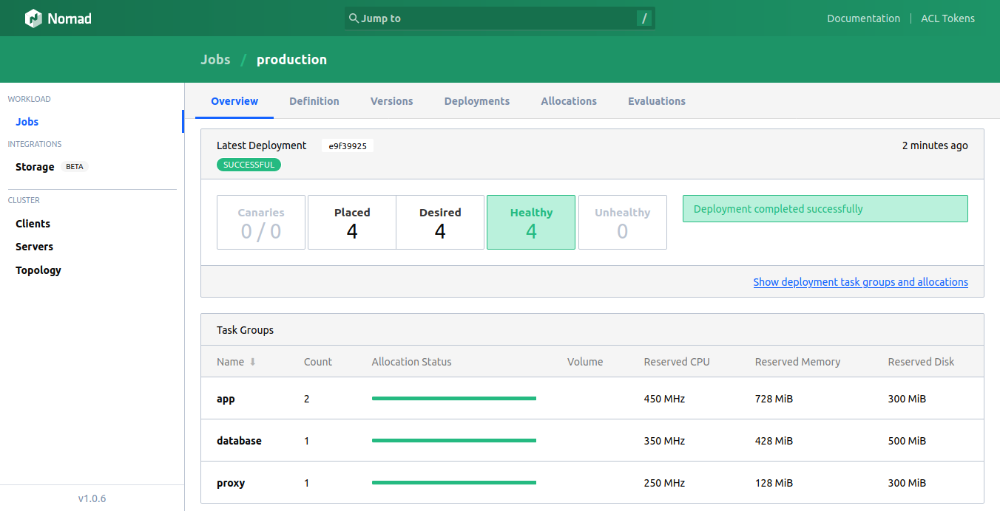

Service mesh with Nomad and Nix
===============================

(Not to forget Consul for the "mesh" part.)

This complete example demonstrates how Nix could be used to package fully self-contained application archives for Nomad's [Isolated Fork/Exec Driver](https://www.nomadproject.io/docs/drivers/exec).



This example assumes [Nix](https://nixos.org/download.html) and works best with [Nix and direnv](https://nix.dev/tutorials/declarative-and-reproducible-developer-environments.html#direnv-automatically-activating-the-environment-on-directory-change).

```bash
$ direnv allow
$ make serve
```

or

```bash
$ nix-shell
$ make serve
```

Warning: The example above does use sudo to be able to execute Nomad jobs with [exec driver](https://www.nomadproject.io/docs/drivers/exec). Nomad home directory is being created with `mktemp -d` to reduce risk of having too long paths for required Unix socket files. The directory name is saved in `/.cache`.

Note: The example includes postgres as a database component with volatile ephemeral disk storage by purpose to make the example more complete. You may not want to use volatile database in most real use cases.

All components, which are orchestrated with Nomad, have random port allocations, which are visible at Nomad's UI at [http://localhost:4646](http://localhost:4646). Consul Connect Ingress Proxy serves the example application at [http://localhost:8800](http://localhost:8800).

In addition, this examples contains [Raw Fork/Exec Driver](https://www.nomadproject.io/docs/drivers/raw_exec) based development mode, where Nomad could be run without sudo, and application is executed directly from the project directory without any isolation:

```bash
$ nix-shell
$ make develop
```

Note: Running `make develop` after `make serve` will fail, because `make serve` will create Nomad home directory with sudo. Run `rm .cache` to remove sentinel for Nomad home, and `make develop` to create new Nomad home, writable with the user.

Prerequisites
-------------

* [Nomad support for Consul Connect requires CNI Plugins installed](https://www.nomadproject.io/docs/integrations/consul-connect#cni-plugins) on the Nomad host.

* [Consul Connect ingress proxy on Nomad requires manual Consul configuration](https://github.com/hashicorp/nomad/issues/8647) which is part of `run-artifact-job` Make target
